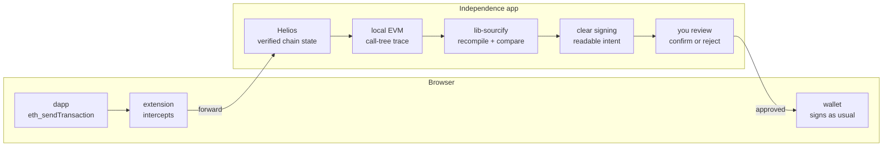

# Project Independence — rebuild plan

A trustless smart-contract transaction builder and verifier. Data may be downloaded from anywhere, but every security-relevant fact is verified locally, on your machine.

This is a living document: it is edited in place, and superseded content is removed, not appended. The interactive version with the UX demo lives as an HTML artifact; this file is the plan of record in the repo.

## What it is

Project Independence lets you inspect contracts, build transactions, and verify the transactions other apps ask you to sign, without trusting any external service. Chain state is proof-verified through an embedded [Helios](https://github.com/a16z/helios) light client (or an RPC endpoint you choose to trust). Source code claims from Sourcify are never believed: sources are recompiled locally and compared byte-for-byte against the on-chain bytecode. What you are about to sign is rendered human-readable with the ERC-7730 clear-signing standard.

## Where we start

A fully working prototype already exists (the `project-independence` repo): a Tauri desktop app that was vibecoded to explore the idea end to end. It is the reference implementation. It defines the target feature set (Helios light client, local Sourcify verification gate, proxy and diamond resolution, ERC-7730 clear signing, local EVM simulation, Ledger signing, post-mining verification, activity history, address book), but none of its code is trusted as-is: every feature re-enters the product through a from-zero rewrite in which each line is reviewed.

## How we rebuild

The rewrite proceeds in versions. Each version adds a small, reviewed set of features, taking inspiration from the target but never copying it blindly. The distribution model is app-first, following the password-manager pattern: you download the app, and the app guides you to install its thin browser-extension companion. Heavy logic lives in the app; the extension stays tiny, near dependency-free, and rarely updated.

## Version 0 — the transaction verifier

A companion that steps in before your wallet does. When any dapp asks you to sign, the extension intercepts the request and hands it to the app, which verifies everything locally and shows you what you are really about to do.

The verifier never signs anything itself: after your confirmation the original request continues untouched to your wallet, which still shows its own confirmation.

### Feature set

- **Interception.** A thin extension wraps the page's EIP-1193 provider (the standard wallet-injection interface) and catches `eth_sendTransaction` and signing requests before the wallet sees them. If the app is not running, the extension prompts to open it, then forwards.
- **Beyond the extension.** The app also accepts requests that never touched a browser: transaction data pasted by hand (a raw transaction, calldata, or an EIP-712 payload), and animated QR codes from air-gapped hardware wallets via [ERC-4527](https://eips.ethereum.org/EIPS/eip-4527), the `eth-sign-request` Uniform Resources format used by Keystone, OneKey, and AirGap.
- **Call-tree simulation.** The transaction is executed locally (ethereumjs EVM) against verified chain state, for one purpose in this version: reconstructing the call tree, so the review shows every contract the transaction actually touches, not just the entry point. Effects preview (balance changes, storage writes, events) is deliberately out of scope until a later version.
- **Local verification gate.** The app fetches the sources of every contract in the call tree from Sourcify, recompiles them locally, and compares the results against the on-chain bytecode. Sourcify's claim is never trusted; we reproduce it.
- **Clear signing.** The verified ABI (Application Binary Interface) plus ERC-7730 descriptors render the request as human-readable intent.
- **Review and continue.** You confirm or reject in the app; on confirm, the original request proceeds untouched to your wallet in the browser.
- **Digest cross-check ([ERC-8213](https://github.com/ethereum/ERCs/pull/1639)).** After you confirm, the app displays the request's digest using the exact terminology the standard mandates: the Calldata Digest for transactions (`keccak256(uint256(len(calldata)) || calldata)`, chain-independent by design) and the EIP-712 Digest for typed-data signatures. A wallet that also implements ERC-8213 (Keycard Shell is the first hardware wallet to do so) shows the same value before signing; comparing the two proves the wallet received exactly the bytes you reviewed, even if the dapp or browser was compromised in between. This closes the last gap in the flow: the app verifies what you review, the digest verifies what you sign.

### Chain support: every chain, two modes

The design is chain-generic from day one: any EVM chain can be added with a chain id and an RPC endpoint. Source verification is always local and trustless on every chain; only the way chain state is fetched differs.

- **Helios mode (automatic).** Where Helios supports the chain, state is verified by the light client. Today: Ethereum mainnet and testnets, the OP Stack family (OP Mainnet, Base, Worldchain, Zora, Unichain), and Linea. Requires an execution RPC with `eth_getProof`.
- **RPC mode (any other chain).** State comes straight from an RPC endpoint the user provides. Running your own node makes this fully secure. RPC mode shows a permanent notice: **only use RPC endpoints you fully trust.**

Per-chain trust details (which mechanism Helios uses, what RPC mode trusts) stay available in an info view for users who want them, without cluttering the main flow.

### Extension ↔ app transport: native messaging

The same architecture password managers converged on. The browser spawns a small relay binary (shipped and registered by the app) and talks to it over stdin/stdout via the Native Messaging API; the relay forwards to the running app over a Unix socket or named pipe. No network socket is ever opened, so no other website, browser, or local process gets a surface to probe.

- **Browser-enforced allowlist.** The host manifest names exactly which extension IDs may connect, and the extension can only address this one host.
- **Encrypted pairing (KeePassXC model).** Extension and app exchange X25519 public keys; every message is sealed with a NaCl box and incrementing nonces. First connection requires explicit approval in the app.
- **Peer verification (1Password model).** Where the OS supports it, the app verifies the connecting browser's code signature (macOS, Windows) or binary ownership (Linux) before accepting the channel.
- **Rust reference implementations.** The relay exists in Rust already: [keepassxc-proxy-rust](https://github.com/varjolintu/keepassxc-proxy-rust) (a tiny standalone stdio→socket relay by the KeePassXC-Browser maintainer) and Bitwarden's [desktop_proxy](https://github.com/bitwarden/clients/tree/main/apps/desktop/desktop_native) (production Rust proxy with end-to-end encryption and replay-mitigating timestamps). Both are GPL-family, so they are study references for our own implementation, not vendored code.

### Securing the supply chain

Zero third-party code is not achievable: Helios, viem, solc, and the ethereumjs EVM are the product. The approach is minimize, pin, delay, verify. The one exception with no compromise: the scripts the extension injects into web pages are hand-written with zero dependencies.

JavaScript (pnpm):

- `minimumReleaseAge` ≥ 7 days: versions younger than a week never install
- lifecycle scripts disabled, near-empty allowlist
- exact pins, committed lockfile, `--frozen-lockfile` in CI
- Sigstore provenance via `npm audit signatures`

Rust (cargo):

- committed `Cargo.lock`, `--locked` in CI
- git dependencies pinned to exact revisions
- `cargo-deny`: advisories, licenses, sources
- `cargo-vet` audits (`build.rs` and proc-macros run code at compile time)

Both ecosystems:

- Renovate proposes updates weekly, with the same release-age delay; direct-dep changelogs are read before merging.
- [Socket](https://socket.dev) reviews every dependency-changing PR with behavioral analysis (install scripts, new network/filesystem/shell access, obfuscation, typosquats, maintainer changes). Deep tier covers npm; Rust relies on cargo-deny and cargo-vet.
- OSV scan in CI for known advisories across crates.io and npm; a software bill of materials ships with every release.
- solc binaries come only from the official solc-bin list, hash-checked before execution.
- Reproducible builds: the store-submitted extension package is diffable against its git tag.
- Releases are built and published only from CI; hardware-key two-factor on store and registry accounts.

### UX

The whole product in one interaction: a dapp request that would open the wallet is intercepted, the app verifies and explains it (verification result with sources and compiler settings, the exact function called, an "open files in your editor" action, clear signing as both extrapolated intent and a table of fields), and only after confirmation does the real wallet take over.

The app's visual style follows Sourcify's design language (sourcify.dev, verify.sourcify.dev, repo.sourcify.dev).

The UX leads the build order: the first step of Version 0 is to vibecode the entire frontend with mocked data (the `mock/` package in this repo) and iterate on it until we are satisfied. Only then does the real, reviewed development start against that refined UX.

## Version 1+

To be planned. Candidates from the target, in no confirmed order: an effects preview built on the Version 0 call-tree simulation (balance changes, storage writes, events), the transaction builder and contract explorer, Ledger signing, post-mining verification and activity history, address book, Firefox port.
