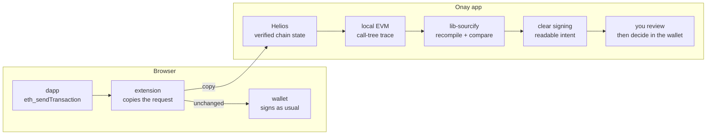

# Onay: local signing companion

A second, independent check on every transaction before you sign. Data may be downloaded from anywhere, but every security-relevant fact is verified locally, on your machine, or shown as missing.

This is a living document: it is edited in place, and superseded content is removed, not appended. The interactive version with the UX demo lives as an HTML artifact; this file is the plan of record in the repo.

## What it is

Ethereum is built around verification, but transaction signing still depends on blind trust: an RPC endpoint for chain state, an explorer for the ABI (Application Binary Interface), the dapp for what the action means. Independent verification is possible and cheap; the problem is usability. Onay turns it into a second check that runs on every signing request.

Onay is a local desktop app with a thin browser extension that sits between the dapp and the wallet. It is view only: it holds no keys and does not replace the wallet. Chain state is proof-verified through an embedded [Helios](https://github.com/a16z/helios) light client (or an RPC endpoint you choose to trust). Source code claims from Sourcify are never believed: sources are recompiled locally and compared byte-for-byte against the on-chain bytecode. What you are about to sign is rendered human-readable with the ERC-7730 clear-signing standard. After you confirm, the ERC-8213 digest lets you check that the wallet received exactly the bytes you reviewed.

## Where we start

A fully working prototype already exists (the `project-independence` repo, from when the project was called Independence): a Tauri desktop app that was vibecoded to explore the idea end to end. It is the reference implementation. It defines the target feature set (Helios light client, local Sourcify verification gate, proxy and diamond resolution, ERC-7730 clear signing, local EVM simulation, Ledger signing, post-mining verification, activity history, address book), but none of its code is trusted as-is: every feature re-enters the product through a from-zero rewrite in which each line is reviewed.

## How we rebuild

The rewrite proceeds in versions. Each version adds a small, reviewed set of features, taking inspiration from the target but never copying it blindly. The distribution model is app-first, following the password-manager pattern: you download the app, and the app guides you to install its thin browser-extension companion. Heavy logic lives in the app; the extension stays tiny, near dependency-free, and rarely updated.

## Version 0 — the transaction verifier

A companion next to your wallet. When any dapp asks you to sign, the extension copies the request to the app, which verifies everything locally and shows you what you are really about to do. The wallet gets the same request at the same time.

```mermaid
flowchart LR
  subgraph browser [Browser]
    dapp["dapp<br/>eth_sendTransaction"]
    ext["extension<br/>copies the request"]
    wallet["wallet<br/>signs as usual"]
  end
  subgraph app [Onay app]
    helios["Helios<br/>verified chain state"]
    sim["local EVM<br/>call-tree trace"]
    sourcify["lib-sourcify<br/>recompile + compare"]
    cs["clear signing<br/>readable intent"]
    review["you review<br/>then decide in the wallet"]
  end
  dapp --> ext
  ext -- unchanged --> wallet
  ext -- copy --> helios
  helios --> sim --> sourcify --> cs --> review
```

The verifier is view only: it never signs and never holds a request back. The wallet receives the original request unchanged and at the same time, and you decide there after you looked at the app.

### Feature set

- **Interception.** A thin extension wraps the page's EIP-1193 provider (the standard wallet-injection interface) and copies `eth_sendTransaction` and signing requests to the app. The call to the wallet is not delayed and not changed. If the app is not running, the extension asks you to open it, then forwards.
- **Beyond the extension.** The app also accepts requests that never touched a browser: transaction data pasted by hand (a raw transaction, calldata, or an EIP-712 payload), and animated QR codes from air-gapped hardware wallets via [ERC-4527](https://eips.ethereum.org/EIPS/eip-4527), the `eth-sign-request` Uniform Resources format used by Keystone, OneKey, and AirGap.
- **Call-tree simulation.** The transaction is executed locally (ethereumjs EVM) against verified chain state, for one purpose in this version: reconstructing the call tree, so the review shows every contract the transaction actually touches, not just the entry point. Effects preview (balance changes, storage writes, events) is deliberately out of scope until a later version.
- **Local verification gate.** The app fetches the sources of every contract in the call tree from Sourcify, recompiles them locally, and compares the results against the on-chain bytecode. Sourcify's claim is never trusted; we reproduce it.
- **Clear signing.** The verified ABI (Application Binary Interface) plus ERC-7730 descriptors render the request as human-readable intent.
- **Review next to the wallet.** The app shows its result while the wallet shows its own confirmation. You approve or reject in the wallet, as always.
- **Digest cross-check ([ERC-8213](https://github.com/ethereum/ERCs/pull/1639)).** The app displays the request's digest using the exact terminology the standard mandates: the Calldata Digest for transactions (`keccak256(uint256(len(calldata)) || calldata)`, chain-independent by design) and the EIP-712 Digest for typed-data signatures. A wallet that also implements ERC-8213 (Keycard Shell is the first hardware wallet to do so) shows the same value before signing; comparing the two proves the wallet received exactly the bytes you reviewed, even if the dapp or browser was compromised in between. This closes the last gap in the flow: the app verifies what you review, the digest verifies what you sign.

### Chain support: every chain, two modes

The design is chain-generic from day one: any EVM chain can be added with a chain id and an RPC endpoint. Source verification is always local and trustless on every chain; only the way chain state is fetched differs.

- **Helios mode (automatic).** Where Helios supports the chain, state is verified by the light client. Today: Ethereum mainnet and testnets, the OP Stack family (OP Mainnet, Base, Worldchain, Zora, Unichain), and Linea. Requires an execution RPC that answers `eth_getProof` for recent blocks, not only for its newest one, because Helios asks at its own head.
- **RPC mode (any other chain).** State comes straight from an RPC endpoint the user provides. Running your own node makes this fully secure. RPC mode shows a permanent notice: **only use RPC endpoints you fully trust.**

Per-chain trust details (which mechanism Helios uses, what RPC mode trusts) stay available in an info view for users who want them, without cluttering the main flow.

### Extension ↔ app transport: native messaging

The same architecture password managers converged on. The browser spawns a small relay binary (shipped and registered by the app) and talks to it over stdin/stdout via the Native Messaging API; the relay forwards to the running app over a Unix socket. No network socket is ever opened, so no other website, browser, or local process gets a surface to probe.

- **Browser-enforced allowlist.** The host manifest names exactly which extension IDs may connect, and the extension can only address this one host.
- **Encrypted pairing (KeePassXC model).** Extension and app each hold a long-term X25519 key. For each connection both sides derive new AES-256-GCM keys with HKDF from the key agreement and two random salts, and a counter nonce makes a lost, repeated, or reordered message fail. The first connection requires explicit approval in the app, with a code that both sides show. The primitives come from the browser's WebCrypto instead of a NaCl box, so the extension needs no crypto dependency and its private key cannot be exported.
- **Peer verification (1Password model).** Before it accepts a connection, the app asks the kernel who is on the other end. The peer must be our relay, and the relay's parent must be an approved browser. On Linux that browser must look installed by a package manager: the binary and its directories belong to root. On macOS the check is the browser's code signature (not implemented yet). In a package, the relay is setgid to its own group, which hardens it against tampering by other programs of the same user.
- **Rust reference implementations.** The relay exists in Rust already: [keepassxc-proxy-rust](https://github.com/varjolintu/keepassxc-proxy-rust) (a tiny standalone stdio→socket relay by the KeePassXC-Browser maintainer) and Bitwarden's [desktop_proxy](https://github.com/bitwarden/clients/tree/main/apps/desktop/desktop_native) (production Rust proxy with end-to-end encryption and replay-mitigating timestamps). Both are GPL-family, so they are study references for our own implementation, not vendored code.

### Securing the supply chain

Zero third-party code is not achievable: Helios, viem, solc, and the ethereumjs EVM are the product. The approach is minimize, pin, delay, verify. The one exception with no compromise: the scripts the extension injects into web pages are hand-written with zero dependencies.

JavaScript (pnpm):

- `minimumReleaseAge` ≥ 7 days: versions younger than a week never install
- lifecycle scripts disabled, near-empty allowlist
- exact pins, committed lockfile, `--frozen-lockfile` in CI
- Sigstore provenance via `npm audit signatures`

Rust (cargo):

- committed `Cargo.lock`, `--locked` in CI
- git dependencies pinned to exact revisions
- `cargo-deny`: advisories, licenses, sources
- `cargo-vet` audits (`build.rs` and proc-macros run code at compile time)

Both ecosystems:

- Renovate proposes updates weekly, with the same release-age delay; direct-dep changelogs are read before merging.
- [Socket](https://socket.dev) reviews every dependency-changing PR with behavioral analysis (install scripts, new network/filesystem/shell access, obfuscation, typosquats, maintainer changes). Deep tier covers npm; Rust relies on cargo-deny and cargo-vet.
- OSV scan in CI for known advisories across crates.io and npm; a software bill of materials ships with every release.
- solc binaries come only from the official solc-bin list, hash-checked before execution.
- Reproducible builds: the store-submitted extension package is diffable against its git tag.
- Releases are built and published only from CI; hardware-key two-factor on store and registry accounts.

### UX

The whole product in one interaction: a dapp request opens the wallet as usual, and at the same time the app verifies and explains it (verification result with sources and compiler settings, the exact function called, an "open files in your editor" action, clear signing as both extrapolated intent and a table of fields), so you can compare before you confirm in the wallet.

The app's visual style follows Sourcify's design language (sourcify.dev, verify.sourcify.dev, repo.sourcify.dev).

The UX came first: the `mock/` package in this repo holds the whole Version 0 frontend with fake data. The real app takes its UI from the mock one feature at a time; the mock stays the place where UX changes are tried before they enter the app.

### Build order

Each step ends with something that runs and can be reviewed. Steps 3 to 6 work on the target contract alone; step 7 extends every one of them to the whole call tree.

0. **Foundations.** Repo layout, CI (continuous integration), and supply-chain checks before any real code.
   - Folders: `app/` (Tauri, relay included) and `extension/` inside this monorepo.
   - CI: frozen lockfiles, cargo-deny, OSV scan, Socket on dependency PRs.
1. **Skeleton.** A minimal Chrome extension and Tauri app talking over native messaging.
   - Tiny relay binary, bundled inside the app: users install only app and extension.
   - The browser starts the relay; it forwards stdin/stdout to the app's local socket.
   - The app installs the host manifest, allowlisting only our extension ID.
   - Ping from the extension, pong from the app, visible on both sides.
2. **Interception and secure channel.** Extension catches signing requests via the page's wallet provider (EIP-1193).
   - Transactions, typed data (EIP-712) and plain messages; everything else passes through untouched.
   - The app shows the raw request.
   - The wallet still receives the request at the same time; the app only serves as a second verification tool.
   - App not running: the extension asks to open it, then forwards.
   - Encrypted pairing (X25519 keys, HKDF, AES-256-GCM), first connection approved in the app.
   - Peer verification where the OS supports it.
   - **To analyse: can an attacker hand the app a different transaction than the one the wallet receives?**
3. **Gate 1: Helios.** Embed Helios; read the target contract's bytecode as verified chain state.
   - Chain registry (chain id plus RPC); Helios where supported, RPC mode elsewhere.
   - RPC mode sits behind the same interface, with its permanent trust notice.
   - Native Rust Helios, exposed to the webview as EIP-1193 over Tauri IPC (inter-process communication).
4. **Gate 2: Sourcify.** Fetch sources, recompile locally, compare against the verified on-chain bytecode.
   - Download solc only from the official list, hash-checked before running.
   - Resolve proxies (EIP-1967 slots) so the implementation gets verified too.
   - Show result, sources, compiler settings; "open files in your editor".
   - Requests to the Sourcify server carry a User-Agent header with the app name and version.
5. **Clear signing (ERC-7730).** Decode the call with the verified ABI (Application Binary Interface).
   - Render intent and field table from ERC-7730 descriptors; plain decoding as fallback.
   - Use our own ERC-7730 library.
6. **Digest (ERC-8213).** Show the Calldata Digest or EIP-712 Digest.
7. **Call-tree simulation.** Run the transaction in a local EVM (ethereumjs) on verified state.
   - Collect every touched contract, run both gates on each, display them all.
   - This also covers delegatecalls and diamonds, replacing the step 4 proxy shortcut.
8. **Other inputs.** Pasted transactions and animated QR codes (ERC-4527) enter the same pipeline.

### Preparing for step 7 from day one

- Model a request as a list of contracts, even when it holds only one.
- Gates take one address and return one result; no single-target assumptions anywhere.
- One chain-state interface (Helios or RPC) that the EVM can later read from.
- Cache gate results per chain and code hash; call trees repeat the same contracts.
- Gates run in parallel and report progress per contract.
- The UI renders a contract list from the start; step 7 only adds entries.
- Early spike: ethereumjs EVM reading state lazily from Helios, to remove the biggest risk.
- Requests enter one pipeline regardless of source, so step 8 is just new inputs.

### Where code runs

- Verification pipeline in TypeScript, in the app's webview: lib-sourcify, ethereumjs, viem, ERC-7730.
- Rust side: relay, native messaging socket, pairing crypto, Helios, file access.
- Helios reaches the webview through Tauri IPC, never a localhost port.
- RPC mode is just another EIP-1193 provider, in the webview: a plain fetch to the user's endpoint, so the webview's Content Security Policy must allow any HTTPS host and local nodes. The pipeline cannot tell the two modes apart.
- The Chrome extension only intercepts and forwards; it never verifies anything.

## Version 1+

To be planned. Candidates from the target, in no confirmed order: an effects preview built on the Version 0 call-tree simulation (balance changes, storage writes, events), the transaction builder and contract explorer, Ledger signing, post-mining verification and activity history, address book, Firefox port. Also for later: the user chooses which attestors to trust.
