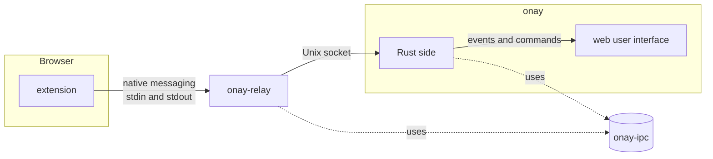

# The Onay app

A Tauri desktop app: a Rust program that shows a web page in its window. The Rust side owns the link to the browser extension, the keys, and later the verification. The web page in the window shows the result. The app never holds wallet keys and never answers a signing request. The wallet decides.

## Build and test

```
pnpm tauri dev         # build the relay, start the page with hot reload, open the window
pnpm build             # type-check and build the page only
pnpm test              # type-check and run the tests of the page's pure modules
pnpm bundle            # the package with the relay inside, in target/release/bundle/
cargo build            # both binaries
cargo test             # all Rust tests
cargo clippy --all-targets -- -D warnings
cargo fmt --all --check
cargo deny check       # advisories, licenses, sources, bans
```

The Rust tests cover the channel against the shared vectors, the key store, the peer rules, the whole link with a fake extension over a socket pair, and the relay binary against a fake app. The page tests in `test/` cover the pure gate modules: what a request names, and how a gate reports.

The package settings live in `src-tauri/tauri.bundle.conf.json`, apart from the main Tauri config, so that `tauri dev` works without a packaged relay. `src-tauri/packaging/postinstall.sh` is the install script of the Linux packages.

## The parts

Three Rust crates in one Cargo workspace, and one web user interface.



| Path         | Builds                  | Does                                                                                                                                                                                                        |
| ------------ | ----------------------- | ----------------------------------------------------------------------------------------------------------------------------------------------------------------------------------------------------------- |
| `ipc/`       | a library               | What relay and app share: the host name, the extension ID, the socket path, and the framing of one native message. No dependencies.                                                                         |
| `relay/`     | the `onay-relay` binary | The bridge that Chrome starts. It copies bytes between the browser and the app's socket and does not read them. No dependencies except `ipc`.                                                               |
| `src-tauri/` | the `onay` binary       | The app. It registers the relay with the browsers, listens on the socket, checks who connects, runs the encrypted channel and the pairing, and keeps the state the window shows. Tauri gives it the window. |
| `src/`       | the page in the window  | React and Tailwind, same setup as the mock. It reads the state through Tauri commands and listens for one event that says "the state changed".                                                              |

The files inside `src/` and `src-tauri/src/` change with every step of the plan, so this document does not list them. The two lasting parts are the relay and the way a message gets into the app.

## From the extension to the window

Chrome can start a program for an extension, but it cannot connect to a program that already runs. This is the native messaging rule, and it is why the relay exists. One connection goes through these steps.

1. **The host manifest.** At start, the app writes a file for each installed browser, for example `~/.config/google-chrome/NativeMessagingHosts/dev.sourcify.onay.json`. The file names the path of the relay binary and the one extension ID that may use it.
2. **Chrome starts the relay.** When the extension connects to the host `dev.sourcify.onay`, Chrome reads that file and starts the relay as a child process. Chrome talks to it over stdin and stdout. Each message is a 4-byte length followed by JSON.
3. **The relay connects to the app.** It opens the app's Unix socket at `$XDG_RUNTIME_DIR/onay/onay.sock` on Linux, or `$TMPDIR/onay/onay.sock` on macOS. Only the user can open that directory. From then on the relay copies bytes in both directions. It does not parse, buffer, or change them. When either side closes, it exits, and Chrome sees the port close. If the app is not running, the relay sends one message, `{"type":"error","message":"app not running"}`, and exits. The extension shows that and tries again later.
4. **The app checks the peer.** The app asks the kernel who connected. On Linux the peer must be our relay, run by the same user, and the relay's parent must be an approved browser that is installed by a package manager: the binary and its directories belong to root. A peer that fails gets one error message, and the window lists the reason. On macOS this check does not exist yet, and the window marks the connection as not verified.
5. **Hello.** Both sides send one message in the clear: their long-term X25519 public key and a random salt. Both derive the session keys with HKDF-SHA-256, two AES-256-GCM keys, one for each direction. The specification and the test vectors are shared with the extension, see `src-tauri/src/channel.rs` and `../testdata/`.
6. **Pairing.** If the app does not know the extension's key, both sides show a six-digit code computed from the two public keys. The user compares the codes and approves in the window. The app stores the key next to its own in the app data directory, for example `~/.local/share/dev.sourcify.onay/link.json` on Linux, and tells the extension. Delete that file to reset all pairings. A rejection closes the connection and stores nothing.
7. **Sealed messages.** Every later message is encrypted with a counter as nonce. A lost, repeated, reordered, or changed message fails to open, and the connection ends. The extension sends three kinds: a signing request that a page made, with the origin that the browser reported, the outcome the wallet gave, and a request to bring the window to the front. The app sends two kinds: paired, and pairing rejected.
8. **State and window.** The app keeps the connections, the pairing requests, and the last 50 signing requests in memory. After each change it emits one event to the page. The page then calls a command that returns the whole state and renders it. Two more commands answer a pairing and dismiss a request.

The relay ships inside the app package, next to the `onay` binary, so the user installs only app and extension. During development both binaries are in `target/debug/`. The Linux package makes the relay setgid to its own group, so the user cannot trace it or preload code into it.
