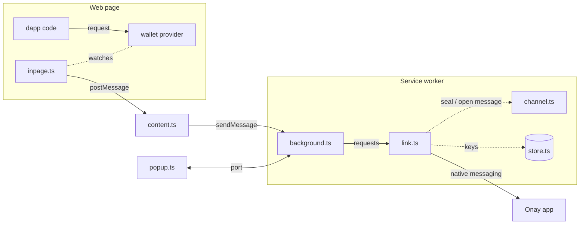

# The Onay extension

A Manifest V3 Chrome extension with no runtime dependencies. It watches the wallet providers on each page and sends a copy of every signing request to the Onay app. The wallet gets the request unchanged and at the same time. The extension never holds keys and never changes a request.

## The parts



| File                         | Runs in                          | Does                                                                                                                                                                                                                   |
| ---------------------------- | -------------------------------- | ---------------------------------------------------------------------------------------------------------------------------------------------------------------------------------------------------------------------- |
| `src/inpage.ts`              | the page, before its own scripts | Replaces `request`, `sendAsync`, and `send` on each wallet provider it finds on `window.ethereum` or through EIP-6963. Reports signing requests and how the wallet answered. Passes everything else through untouched. |
| `src/content.ts`             | isolated world of the page       | Passes the reports of `inpage.ts` to the service worker. A page script cannot call the extension, so this is the bridge.                                                                                               |
| `src/background.ts`          | service worker                   | Checks each report, adds the origin from the browser, and sends it to the app. Keeps requests that wait for the app. Opens the status window when the user must act.                                                   |
| `src/link.ts`                | service worker                   | The connection to the app: hello exchange, pairing, sealed messages, and the status of the link. No browser calls of its own, so the tests run it with fakes.                                                          |
| `src/channel.ts`             | service worker                   | The encrypted channel: X25519 key agreement, HKDF-SHA-256, AES-256-GCM with counter nonces. Same specification as `app/src-tauri/src/channel.rs`.                                                                      |
| `src/store.ts`               | service worker                   | IndexedDB: the extension's own key pair, which no script can export, and the public key of the paired app.                                                                                                             |
| `src/popup.ts`, `popup.html` | toolbar popup and status window  | Shows the state of the link and the pairing code. Retries while the app is not there.                                                                                                                                  |
| `src/messages.ts`            | compile time only                | Every message type between the parts above and between extension and app.                                                                                                                                              |
| `manifest.json`              |                                  | Permissions, content scripts, the `key` that fixes the extension ID.                                                                                                                                                   |

`inpage.ts` and `content.ts` are plain scripts, not modules. The others are ES modules. The page can see and change everything in `inpage.ts`, so nothing there is a security boundary.

## One request, step by step

1. The dapp calls `provider.request({ method: "eth_sendTransaction", ... })`.
2. `inpage.ts` asks the wallet for its chain with `eth_chainId`, then at once calls the wallet's original method with the same arguments. The wallet opens. When the chain answer comes, or after 2 seconds without one, `inpage.ts` posts a copy with the chain ID to the window. For the other signing methods it posts the copy first and does not ask for the chain.
3. `content.ts` forwards the copy to the service worker.
4. `background.ts` checks the method, the size, and the chain ID, sets the origin, and hands the request to `link.ts`. The page can forge the chain ID, so the app shows it as reported, not as verified.
5. `link.ts` seals it with the session key and sends it to the app through the relay. If the app is not there, the request waits and the status window asks the user to start the app.
6. When the wallet answers the dapp, `inpage.ts` reports the outcome the same way.

## The link to the app

1. On start, `link.ts` connects to the native messaging host `dev.sourcify.onay`. Chrome starts the relay, and the relay connects to the app.
2. Both sides send a hello in the clear: public key and a random salt. Both derive the session keys.
3. If the app does not know this extension, both sides show a six-digit pairing code. The user compares them and approves in the app.
4. From then on every message is sealed. A lost, repeated, or reordered message ends the connection.

## Build and test

```
pnpm build      # dist/: load it unpacked in Chrome
pnpm test       # build, type-check, and run the tests with node --test
pnpm package    # onay-extension.zip for the Chrome Web Store
```

The tests in `test/` run the channel against the shared vectors in `../testdata/`, the link against a fake app, and the built `dist/inpage.js` inside a fake page.

## Fonts

The fonts in `fonts/` are the unmodified IBM Plex files from [IBM's repository](https://github.com/IBM/plex) at commit `763c36ef9117`, under the SIL Open Font License 1.1 (`fonts/LICENSE.txt`). Their SHA-256 checksums:

```
33faf307fa6031fb4062276d7320a6d632de890cbb347576fd80cfa01077bc25  IBMPlexMono-Medium.woff2
ba204497f16b6d334cee9d1e963a831b73e3a56e1d6300a8489d18df7214b350  IBMPlexMono-Regular.woff2
5660f8a658f8bb50dbc005232f885eadffd2bc1c235c4f6fbb63469d1f9cde6d  IBMPlexSans-Medium.woff2
ba711a3085ff9f27440b6b9c4550cfc47c97bf36591d5da958b975bb3add8c1a  IBMPlexSans-Regular.woff2
f78048030eab62e860efa39a0df79e2e5581bf122eb95b9bc42c0b8a4988d205  IBMPlexSans-SemiBold.woff2
```
